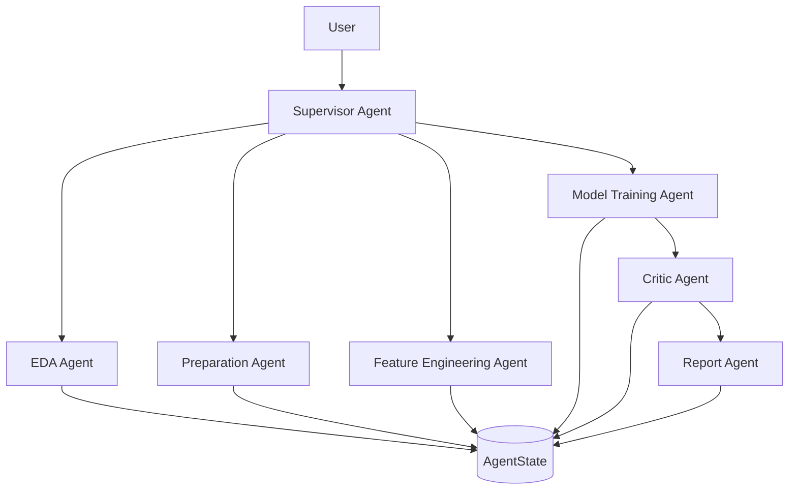

# SynapseAI

### Autonomous Multi-Agent Framework for Machine Learning

An experimental Agentic AI framework that automates end-to-end machine learning workflows through collaboration between specialized AI agents. SynapseAI leverages Large Language Models to generate executable Python code, securely runs it inside an isolated sandbox, evaluates the results, and iteratively improves the pipeline through autonomous reasoning.


---
## Motivation

Modern machine learning workflows involve repetitive tasks such as exploratory data analysis, preprocessing, feature engineering, model selection, evaluation, and reporting. While existing tools automate parts of this process, they typically follow static pipelines and offer limited adaptability.

SynapseAI investigates whether these responsibilities can instead be delegated to a team of specialized AI agents that reason, collaborate, and iteratively improve a machine learning workflow through a shared state and autonomous code generation.
## Overview

Traditional machine learning workflows often require extensive manual effort, from understanding datasets and preprocessing data to selecting models and evaluating performance. Existing AutoML systems automate portions of this process but generally follow predefined, rigid pipelines with limited adaptability.

SynapseAI explores a different approach by treating each stage of the machine learning lifecycle as an independent reasoning task performed by a specialized AI agent.

Instead of relying on a single LLM prompt to solve the entire problem, SynapseAI decomposes the workflow into autonomous agents that collaborate through a shared **Blackboard Architecture**. Every agent is responsible for a single stage of the pipeline, generates Python code using an LLM, executes the generated code inside a secure sandbox, analyzes the results, updates a shared state, and transfers control back to the Supervisor Agent.

This architecture enables iterative reasoning, modularity, extensibility, and transparent decision-making while maintaining a clear separation of responsibilities across the system.

---

## Key Features

- Multi-agent architecture for autonomous machine learning workflows
- Blackboard-based shared memory using a centralized `AgentState`
- LLM-driven Python code generation
- Secure sandboxed code execution
- Automated exploratory data analysis
- Intelligent data preprocessing
- Feature engineering and optimization
- Automatic model training and evaluation
- Leaderboard generation and best model selection
- Critic agent for iterative refinement
- Automatic Markdown and JSON report generation
- Execution history and decision logging
- Modular and extensible agent architecture
- Retry mechanism with workflow supervision

---

## System Architecture

SynapseAI follows a centralized orchestration model where a Supervisor Agent coordinates multiple specialized agents. Rather than communicating directly with one another, every agent interacts exclusively through a shared `AgentState`, ensuring loose coupling and a single source of truth throughout execution.



---

## Blackboard Architecture

SynapseAI adopts the Blackboard Architecture, a collaborative problem-solving model in which independent agents share information through a centralized memory structure instead of communicating directly.

Each agent follows the same execution cycle:

1. Read the current `AgentState`.
2. Analyze available artifacts and metadata.
3. Generate Python code using the configured LLM.
4. Execute the generated code inside the sandbox.
5. Store newly generated artifacts and execution results.
6. Update the shared state.
7. Return control to the Supervisor Agent.

```text
               Agent
                 │
        Read AgentState
                 │
        Analyze Current State
                 │
      Generate Python Code
                 │
      Execute Inside Sandbox
                 │
        Produce Artifacts
                 │
       Update AgentState
                 │
      Return to Supervisor
```

### Advantages

- Independent and reusable agents
- Loose coupling between components
- Centralized execution history
- Simplified debugging
- Easier system extension
- Improved maintainability
- Clear separation of responsibilities

---

## Why Multiple Agents?

Most LLM-based machine learning systems rely on a single prompt to perform the entire workflow. While straightforward, this approach makes debugging difficult, increases prompt complexity, and tightly couples every stage of the pipeline.

SynapseAI instead decomposes the workflow into specialized agents, each responsible for solving a single well-defined problem.

This design provides several advantages:

- Improved modularity
- Better prompt specialization
- Independent reasoning for each task
- Easier debugging and testing
- Fault isolation
- Greater extensibility
- Cleaner orchestration
- Transparent execution history

By limiting each agent to a focused responsibility, the overall system becomes easier to maintain, improve, and extend over time.

---

## Agent Responsibilities

| Agent | Primary Responsibility |
|--------|------------------------|
| Supervisor Agent | Workflow orchestration, routing, and retry management |
| EDA Agent | Dataset inspection and exploratory data analysis |
| Preparation Agent | Data cleaning and preprocessing |
| Feature Engineering Agent | Feature generation and optimization |
| Model Agent | Model training, evaluation, and leaderboard generation |
| Critic Agent | Model review, validation, and refinement |
| Report Agent | Report generation and workflow summarization |

---

## Workflow

The execution pipeline is orchestrated by the Supervisor Agent. Each specialized agent contributes to a single stage of the machine learning workflow while continuously updating the shared `AgentState`.

```text
                     User
                      │
                      ▼
              Supervisor Agent
                      │
                      ▼
             Select Next Agent
                      │
                      ▼
            Construct LLM Prompt
                      │
                      ▼
              Generate Python Code
                      │
                      ▼
           Execute Inside Sandbox
                      │
                      ▼
         Validate Execution Results
                      │
                      ▼
            Update AgentState
                      │
                      ▼
         Supervisor Selects Next Step
                      │
                      ▼
              Final Report Generated
```

---

## Project Structure

```text
synapseai/
│
├── agents/
│   ├── __init__.py
│   ├── base_agent.py
│   ├── supervisor.py
│   ├── eda_agent.py
│   ├── prep_agent.py
│   ├── feature_agent.py
│   ├── model_agent.py
│   ├── critic_agent.py
│   └── report_agent.py
│
├── core/
│   ├── state.py
│   ├── sandbox.py
│   ├── guardrails.py
│   ├── llm_client.py
│   └── prompts.py
│
├── workspace/
│   ├── data/
│   ├── models/
│   └── reports/
│
├── main.py
├── requirements.txt
└── README.md
```

---

## Design Philosophy

SynapseAI is built around a few core engineering principles:

- **Modularity** – Every agent performs one well-defined task.
- **Autonomy** – Agents independently reason about their objectives.
- **Security** – All generated code executes inside a restricted sandbox.
- **Transparency** – Every execution is logged and reproducible.
- **Extensibility** – New agents can be introduced without modifying existing components.
- **Explainability** – The complete workflow and generated artifacts remain observable through the shared state.

---


## Agent Pipeline

The Supervisor Agent coordinates the complete execution lifecycle by routing control between specialized agents. Each agent performs a single task, updates the shared `AgentState`, and returns control to the Supervisor for the next stage.

---

### Supervisor Agent

The Supervisor is responsible for orchestrating the entire workflow. Rather than performing machine learning tasks itself, it manages execution order, validates workflow progress, and determines the next agent to execute.

**Responsibilities**

- Initialize the execution pipeline
- Route execution between agents
- Manage retries after failures
- Prevent infinite execution loops
- Monitor workflow progress
- Track execution history
- Determine pipeline completion

---

### EDA Agent

The Exploratory Data Analysis (EDA) Agent performs an initial assessment of the dataset and gathers statistical information required by downstream agents.

**Responsibilities**

- Dataset inspection
- Missing value detection
- Duplicate identification
- Feature type inference
- Statistical summaries
- Target variable analysis
- Class imbalance detection
- Correlation analysis
- Problem type detection
- Dataset metadata generation

**Generated Artifacts**

- Dataset summary
- Feature statistics
- Missing value report
- Correlation matrix
- EDA report

---

### Preparation Agent

The Preparation Agent cleans and transforms the dataset into a format suitable for machine learning.

Depending on the dataset characteristics identified by the EDA Agent, preprocessing strategies are selected dynamically.

**Responsibilities**

- Missing value imputation
- Categorical encoding
- Numerical feature scaling
- Outlier handling
- Invalid value detection
- Feature validation
- Train/Test split preparation
- Dataset consistency checks

**Generated Artifacts**

- Cleaned dataset
- Encoders
- Scalers
- Preprocessing metadata

---

### Feature Engineering Agent

The Feature Engineering Agent improves dataset quality by creating, removing, or transforming features before model training.

**Responsibilities**

- Constant feature removal
- Correlation-based feature elimination
- Datetime feature extraction
- Polynomial feature generation
- Interaction feature generation
- Feature selection
- Dataset optimization

**Generated Artifacts**

- Engineered dataset
- Feature importance metadata
- Feature selection report

---

### Model Agent

The Model Agent is responsible for training and evaluating multiple candidate models before selecting the best-performing solution.

Rather than relying on a single algorithm, the agent evaluates multiple machine learning models and ranks them according to task-appropriate evaluation metrics.

Supported models currently include:

- Logistic Regression
- Random Forest
- Gradient Boosting
- XGBoost
- LightGBM
- CatBoost
- Support Vector Machine
- K-Nearest Neighbors
- Multi-Layer Perceptron (MLP)

The Model Agent automatically performs:

- Problem type detection
- Train/Test split
- Model training
- Performance evaluation
- Metric computation
- Model serialization
- Leaderboard generation
- Best model selection

**Generated Artifacts**

- Trained models
- Leaderboard
- Evaluation metrics
- Serialized best model

---

### Critic Agent

The Critic Agent evaluates the outputs produced by the Model Agent and determines whether additional training iterations are required.

Rather than blindly accepting the highest-scoring model, the Critic performs quality assurance on generated artifacts.

**Responsibilities**

- Overfitting detection
- Underfitting detection
- Metric validation
- Leaderboard verification
- Missing artifact detection
- Performance consistency checks
- Retry recommendations

If the generated models fail predefined quality checks, the Critic requests another iteration of model training.

---

### Report Agent

The Report Agent consolidates all artifacts generated throughout execution into comprehensive reports suitable for users and downstream systems.

**Generated Reports**

- Markdown report
- JSON summary
- Executive summary
- Dataset overview
- Training history
- Model leaderboard
- Best model information
- Pipeline execution summary

---

## Agent Communication

Agents do not communicate directly with one another.

Instead, every interaction occurs through the centralized `AgentState`.

```text
Supervisor
      │
      ▼
Current Agent
      │
      ▼
Read AgentState
      │
      ▼
Generate Python Code
      │
      ▼
Execute in Sandbox
      │
      ▼
Generate Artifacts
      │
      ▼
Update AgentState
      │
      ▼
Return Control
```

This design keeps every component independent while ensuring a consistent and reproducible workflow.

---

## Secure Sandbox

Since SynapseAI executes LLM-generated Python code, all execution occurs inside an isolated sandbox environment.

Before execution, generated code is validated to reduce the risk of unsafe operations.

Current safeguards include:

- Abstract Syntax Tree (AST) validation
- Import whitelist
- Forbidden import detection
- Dangerous function detection
- Runtime timeout
- Temporary isolated execution
- Workspace isolation
- Automatic cleanup
- Execution logging

The sandbox ensures that generated code cannot directly modify the host environment outside the designated workspace.

---

## Security

Every generated script undergoes multiple validation stages before execution.

### Static Validation

- Syntax verification
- AST parsing
- Import validation
- Forbidden module detection
- Dangerous function detection

### Runtime Protection

- Execution timeout
- Isolated workspace
- Temporary execution environment
- Controlled artifact generation
- Automatic cleanup

These safeguards are designed to minimize risks associated with executing dynamically generated code.

---

## Installation

Clone the repository:

```bash
git clone https://github.com/yourusername/synapseai.git

cd synapseai
```

Install the required dependencies:

```bash
pip install -r requirements.txt
```

Install and start Ollama:

```bash
ollama pull qwen3:8b

ollama serve
```

---

## Running SynapseAI

Run the framework using:

```bash
python main.py \
    --dataset workspace/data/raw/iris.csv \
    --target species
```

To specify a different language model:

```bash
python main.py \
    --dataset workspace/data/raw/iris.csv \
    --target species \
    --model qwen3:8b
```

---

## Outputs

Upon successful execution, SynapseAI generates a structured workspace containing processed datasets, trained models, reports, and execution metadata.

```text
workspace/

├── data/
│   └── processed/
│
├── models/
│   ├── best_model.pkl
│   ├── leaderboard.csv
│   ├── metrics.json
│   └── candidate_models/
│
├── reports/
│   ├── report.md
│   ├── summary.json
│   └── execution_log.md
│
└── state.json
```

---

## Example Execution Flow

```text
Load Dataset
      │
      ▼
EDA Agent
      │
      ▼
Preparation Agent
      │
      ▼
Feature Engineering Agent
      │
      ▼
Model Agent
      │
      ▼
Critic Agent
      │
      ├────────── Quality Check Failed ──────────┐
      │                                          │
      ▼                                          │
Report Agent                                     │
      │                                          │
      ▼                                          │
Finish ◄─────────────────────────────────────────┘
```

---

## Roadmap

The long-term vision for SynapseAI is to evolve into a fully autonomous machine learning framework capable of understanding datasets, selecting appropriate workflows, optimizing models, and generating production-ready artifacts with minimal human intervention.

### Current

- [x] Multi-agent architecture
- [x] Blackboard-based shared state
- [x] Supervisor orchestration
- [x] Exploratory Data Analysis Agent
- [x] Data Preparation Agent
- [x] Feature Engineering Agent
- [x] Model Training Agent
- [x] Critic Agent
- [x] Report Generation Agent
- [x] Secure sandbox execution
- [x] LLM-powered code generation
- [x] Execution history logging
- [x] Automatic retry mechanism

### Planned

- [ ] Hyperparameter optimization
- [ ] Multi-LLM support (OpenAI, Gemini, Claude)
- [ ] Retrieval-Augmented Generation (RAG) for dataset understanding
- [ ] Human-in-the-loop workflow refinement
- [ ] Docker deployment
- [ ] REST API
- [ ] Interactive web dashboard
- [ ] Distributed execution
- [ ] Multi-modal dataset support
- [ ] Experiment tracking integration
- [ ] Automatic visualization generation
- [ ] Plugin system for custom agents

---

## Technology Stack

### Core

- Python
- Pydantic

### Machine Learning

- Scikit-Learn
- XGBoost
- LightGBM
- CatBoost

### Data Processing

- Pandas
- NumPy

### Visualization

- Matplotlib
- Plotly

### Large Language Models

- Ollama
- Qwen3:8B

---

## Design Principles

SynapseAI is built around a small set of engineering principles that guide both its architecture and implementation.

### Modularity

Every agent is responsible for solving a single well-defined problem. This keeps components independent and simplifies maintenance.

### Extensibility

New agents can be introduced without modifying existing components, allowing the framework to evolve naturally over time.

### Explainability

Every decision, generated artifact, and execution step is preserved through the shared `AgentState`, making the workflow transparent and reproducible.

### Security

All generated code executes inside an isolated sandbox after undergoing multiple validation stages.

### Reproducibility

Execution history, generated artifacts, evaluation metrics, and reports are preserved to enable reproducible experiments.

---

## Current Limitations

SynapseAI is an experimental research framework and currently has several limitations.

- Local LLM inference only
- No hyperparameter optimization
- No distributed execution
- No web interface
- No REST API
- Single-machine execution
- Limited support for deep learning workflows

These limitations are active areas of future development.

---

## Challenges

Building an autonomous multi-agent machine learning framework introduces several engineering challenges beyond traditional machine learning pipelines.

Some of the key challenges addressed during development include:

- Coordinating multiple independent agents
- Maintaining a centralized shared state
- Secure execution of LLM-generated code
- Preventing infinite execution loops
- Tracking execution history
- Validating dynamically generated Python code
- Managing artifacts across multiple workflow stages
- Designing reusable agent abstractions

---

## Future Directions

Several research directions are planned for future versions of SynapseAI.

These include:

- Autonomous hyperparameter optimization
- Retrieval-Augmented Generation for dataset reasoning
- Multi-agent collaboration strategies
- Distributed execution across multiple workers
- Human feedback integration
- Automatic workflow planning
- Multi-modal machine learning support
- Interactive visualization dashboards
- Production deployment tooling

---

## Contributing

Contributions are welcome.

If you would like to contribute:

1. Fork the repository.
2. Create a new feature branch.
3. Commit your changes.
4. Submit a pull request.

Bug reports, feature requests, and architectural discussions are also encouraged through GitHub Issues.

---

## Project Status

SynapseAI is currently under active development as a research project exploring autonomous multi-agent systems for machine learning.

Although functional, the framework should be considered experimental and is not yet intended for production environments.

---

## Citation

If you use SynapseAI in academic work or research, please consider citing the repository.

```text
Tanmay Gupta.
SynapseAI: An Autonomous Multi-Agent Framework for Machine Learning.
GitHub Repository.
```

---

## License

This project is licensed under the MIT License.

See the `LICENSE` file for more information.

---

## Acknowledgements

SynapseAI builds upon the open-source machine learning and LLM ecosystem.

Notable projects and libraries include:

- Python
- Pandas
- NumPy
- Scikit-Learn
- XGBoost
- LightGBM
- CatBoost
- Pydantic
- Ollama

---

## Author

**Tanmay Gupta**

SynapseAI was developed as a research project exploring autonomous multi-agent systems, secure LLM code generation, and intelligent machine learning workflow automation.

The project aims to investigate how specialized AI agents can collaborate to perform complex machine learning tasks while maintaining modularity, transparency, and extensibility.

---

## Disclaimer

SynapseAI is an experimental research project.

Generated code is produced by a Large Language Model and executed inside a restricted sandbox. Although multiple validation mechanisms are implemented, generated code should always be reviewed before being used in production or safety-critical environments.